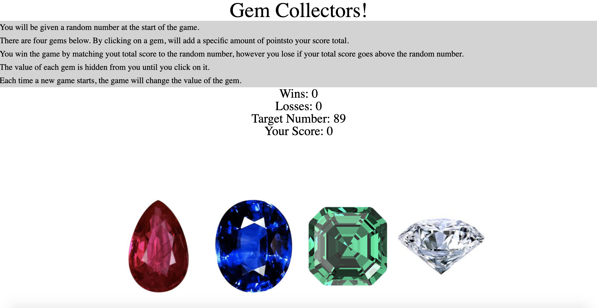

# unit-4-game

##Summary

This contains the Gem Collectors game using Javasciprt and Jquery.

##Site Picture



## Technologies Used 

HTML - Used to create the base structure of the game.

CSS - Styles the page make most content centered. 

Javascript - Makes the functions of the game work.

JQuery - Supports Javascript code.

##Code Snipit

This snipit shows the click function and conditional statements used to display wins,losses, and score totals.

```js

$("#imageDiv").on("click", ".gem", function () {
        var gemValue = ($(this).attr("data-crystalvalue"));
        gemValue = parseInt(gemValue);

        scoreTotal = scoreTotal + gemValue;
        
        if (scoreTotal === randomTargetNumber) {
            wins++;
            
            updateDom();
            resetGame();
        }
        
        if (scoreTotal > randomTargetNumber) {
            losses++;
            updateDom();
            resetGame();
        }

        updateDom();


    }); 

    });